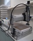

# Cartesian coordinate robot for dispensing fruit fly food

<<<<<<< HEAD
Source code for software and documentation.

=======
{:height="36px" width="36px"}
>>>>>>> 6bb395b8fcb773e37b0751803ad3c34a16e6ebe4

## Hardware documentation
The build of the hardware is described on [docubricks](http://docubricks.com/):
[CNC fly food dispenser](http://docubricks.com/viewer.jsp?id=8652757760093769728)

Source of the docubricks documentation:
https://github.com/WaylandM/fly-food-robot/tree/master/docubricks

## Software 
Source code:
https://github.com/WaylandM/fly-food-robot/tree/master/raspberrypi/robot/

## Operating instructions
A bookdown book describing software installation, configuration and operation of the robot can be found here:
https://waylandm.github.io/fly-food-robot/
