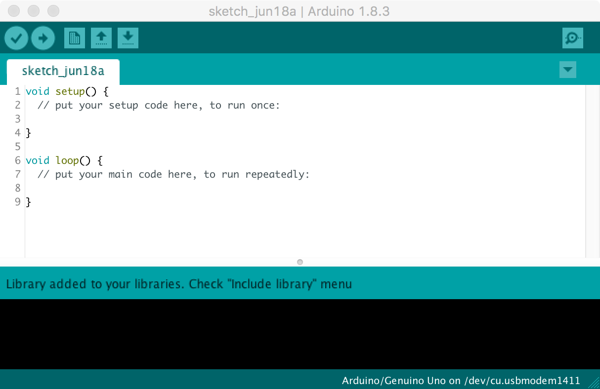
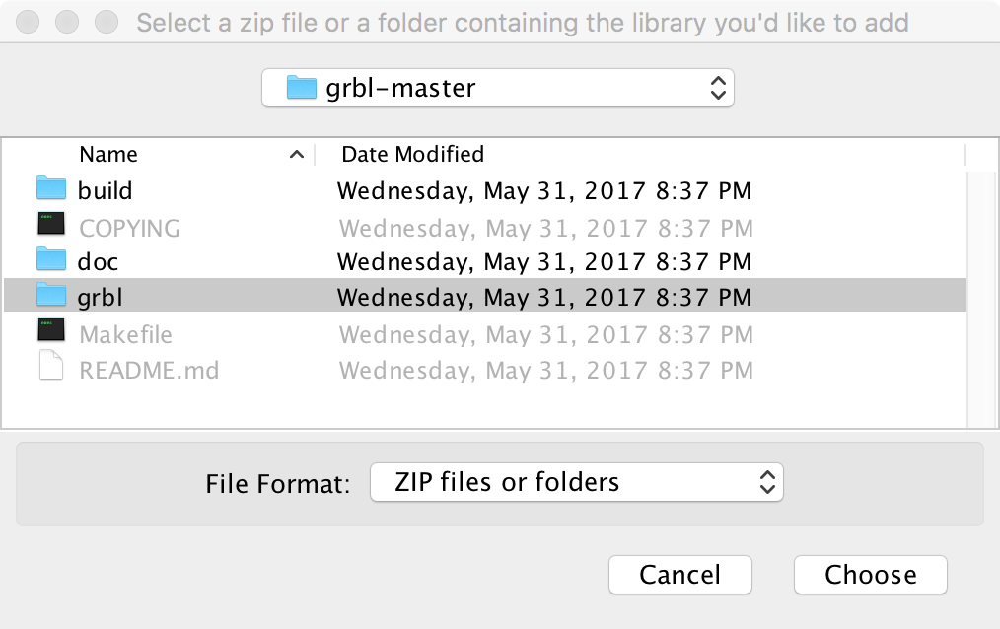
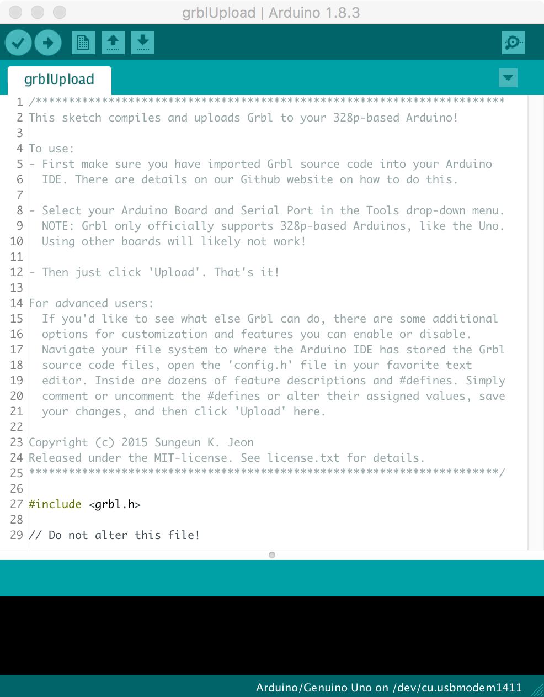
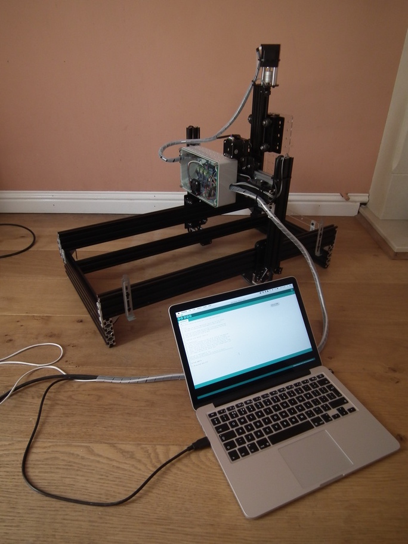
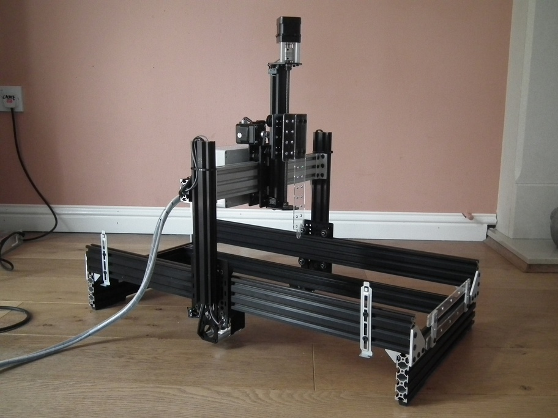

# Grbl installation and configuration

## Overview

CNC motion control is provided by grbl (https://github.com/gnea/grbl), an open source, embedded, high performance g-code parser. Grbl is written in optimized C and runs directly on an Arduino. This is used in conjunction with the gShield (formerly known as grblshield) which provides the hardware drivers for the stepper motors. Grbl sends out TTL signals on pins A3 and 13 or the Arduino to control coolant flow and spindle direction, respectively. Here these signals are used to remotely control a peristaltic pump. 

## Flashing Grbl to Arduino

To flash Grbl to the Arduino you will need a computer with the latest version of the [Arduino IDE](https://www.arduino.cc/en/Main/Software) installed. The following instructions for flashing Grbl to the Arduino are taken from: https://github.com/gnea/grbl/wiki/Compiling-Grbl

_**NOTE: Before starting, delete prior Grbl library installations from the Arduino IDE. Otherwise, you'll have compiling issues! On a Mac, Arduino libraries are located in ```~/Documents/Arduino/libraries/```. On Windows, it's in ```My Documents\Arduino\libraries```.**_

1. Download the Grbl source code.
 * Open the following page in your web browser: https://github.com/gnea/grbl
 * Click on the ```<>Code``` Tab
 * Click the ```Clone or Download``` green button on the Grbl home page.
 * Click the ```Download ZIP```
 * Unzip the download and you'll have a folder called ```grbl-XXX```, where `XXX` is the release version. 
 
2. Launch the Arduino IDE
 * Make sure you are using the most recent version of the Arduino IDE!
```{r arduinoIDE, echo=FALSE, out.width='75%', fig.align='center', fig.cap="Arduino IDE"}

```

3. Load Grbl into the Arduino IDE as a Library.
 * Click the ```Sketch``` drop-down menu, navigate to ```Include Library``` and select ```Add .ZIP Library```.
 * **IMPORTANT:** Select the ```Grbl``` folder **_inside_** the ```grbl-XXX``` folder, which **only** contains the source files and an example directory.
```{r addGrblLib, echo=FALSE, out.width='75%', fig.align='center', fig.cap="Loading Grbl library into the Arduino IDE"}

```
 * If you accidentally select the `.zip` file or the wrong folder, you will need to navigate to your Arduino library, delete the mistake, and re-do Step 3.
 
4. Open the `GrblUpload` Arduino example.
 * Click the ```File``` drop-down menu, navigate to ```Examples->Grbl```, and select ```GrblUpload```.
```{r grblUploadFile, echo=FALSE, out.width='75%', fig.align='center', fig.cap="GrblUpload example file"}

```

5. Compile and upload Grbl to your Arduino.
 * Connect your computer directly to the Arduino using the USB cable.
```{r laptop2arduino, echo=FALSE, out.width='75%', fig.align='center', fig.cap="Laptop connected directly to Arduino"}

```

 * Make sure your board is set to the Arduino Uno in the ```Tool->Board``` menu and the serial port is selected correctly in ```Tool->Serial Port```. 
 * Click the ```Upload```, and Grbl should compile and flash to your Arduino! (Flashing with a programmer also works by using the ```Upload Using Programmer``` menu command.)

## Check serial connection to Grbl

_**NOTE: Before powering up the gShield and motors, check that the actuator carriages for all three axes are approximately centred. Initially we do not know in which direction the actuator carriages will travel when G-code commands are issued, so positioning each in the middle of its range reduces the risk of collisions with the end stops.**_

```{r actuators_centred, echo=FALSE, out.width='75%', fig.align='center', fig.cap="Actuator carriages centred in preparation for powering-up motors for first time."}

```


1. Open serial monitor in Arduino IDE
 * Click ```Tools``` drop-down menu, and select ```Serial Monitor```
 


## fine adjustment of motors
