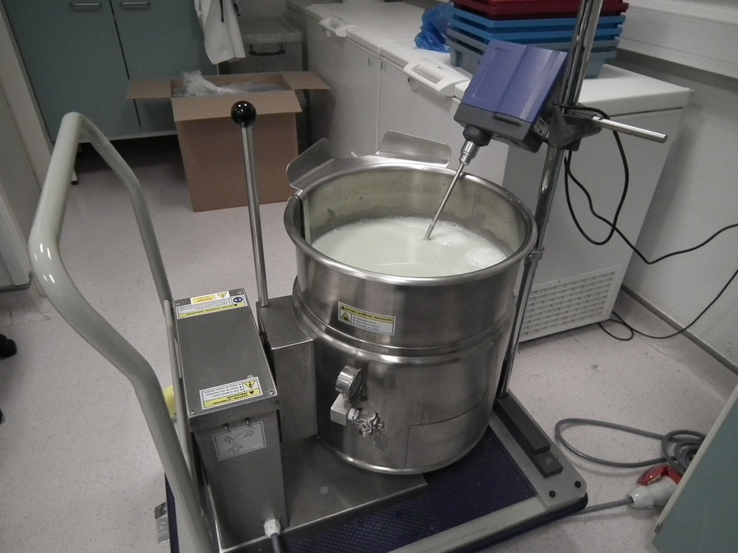

# Program robot to fill vials {#gcode}

Running job without GUI - for testing

<!--
# need 8-9 ml
# pump speed 1800ml/min
# ml/s = 1800/60 = 30
# fill time = 0.3
-->


```
ssh pi@192.168.1.3

sudo minicom -D /dev/ttyACM0 -b115200

?<Idle|MPos:-5.000,-5.000,-4.993|FS:0,0|Ov:100,100,100>

x-10 y-10 z-10
ok
?<Idle|MPos:-10.000,-10.000,-10.005|FS:0,0>


x-20 y-20 z-30
ok
?<Idle|MPos:-20.000,-20.000,-29.996|FS:0,0>


x-8 y-14 z-62
ok
?<Idle|MPos:-8.000,-14.000,-62.006|FS:0,0>


./robot/py/calibrate_pump.py

./robot/py/stream2.py robot/nc/calibrate_pump.nc /dev/ttyACM0

./robot/py/fill_boxes.py

```

## Overview
The movement of the robot is programmed in [G-code](https://en.wikipedia.org/wiki/G-code). We only need nine G-code commands to control the robot (table \@ref(tab:gCodes)).

```{r gCodes, echo=FALSE}
command <- c("x", "y", "z", "g4",  "m3", "m4", "m8", "m9", "$h")
description <- c("absolute position of x-axis", "absolute position of y-axis", "absolute position of z-axis", "dwell time (control parameter p specifies seconds)", "set pump rotation to clockwise", "set pump rotation to counter clockwise", "start pump", "stop pump", "initiate homing cycle")
commandDescriptions <- as.data.frame(cbind(command,description))
names(commandDescriptions) <- c("Code", "Description")
knitr::kable(
  commandDescriptions, booktabs = TRUE,
  caption = 'G-code commands used to control robot.'
)
```

A G-code program for filling vials of food could be created manually, by listing the necessary commands sequentially in a text file.  However, this would be laborious and error prone. If the size of the boxes of vials are known, the G-code can be programmatically generated. 

## Start system {#startSystem}

1. Attach the nozzle end of the Norprene tubing to the holder on the Z-axis actuator using releasable cable ties (figure \@ref(fig:attachNozzle)).
```{r attachNozzle, echo=FALSE, out.width='75%', fig.align='center', fig.cap="Attachment of nozzle end of tubing to the Z-axis actuator."}
knitr::include_graphics("images/pump4.jpg")
```

2. Attach the Masterflex Norprene tubing to the right-hand side vertical post using a releasable cable tie. Ensure there is a large loop in the tubing between this attachment point and the nozzle so that the x-axis actuator can move freely (figure \@ref(fig:tubingPost))
```{r tubingPost, echo=FALSE, out.width='75%', fig.align='center', fig.cap="Attachment of Norprene tubing to the right-hand side vertical post."}
knitr::include_graphics("images/pump5.jpg")
```

3. Feed the tubing through the peristaltic pump (figure \@ref(fig:tubingPump)) and into your vat of fly food (figure \@ref(fig:flyFoodVat)).

```{r tubingPump, echo=FALSE, out.width='75%', fig.align='center', fig.cap="Norprene tubing passing through peristaltic pump."}
knitr::include_graphics("images/pump6.jpg")
```

```{r flyFoodVat, echo=FALSE, out.width='75%', fig.align='center', fig.cap="Vat of fly food."}

```


4. Switch on all devices: 
 * power supply unit for gShield and motors
 * raspberry pi
 * peristaltic pump
 
5. Prime pump 
 * Position a beaker under the nozzle  (figure \@ref(fig:primeBeaker)).
 * Press and hold the prime button on the front of the peristaltic pump until a continuous stream of fly food is pumped into the beaker (figure \@ref(fig:primeButton))

```{r primeBeaker, echo=FALSE, out.width='75%', fig.align='center', fig.cap="Positioning of beaker under nozzle to collect fly food expelled during priming of peristaltic pump."}
knitr::include_graphics("images/prime_beaker.jpg")
```

```{r primeButton, echo=FALSE, out.width='75%', fig.align='center', fig.cap="Prime button on peristaltic pump."}
knitr::include_graphics("images/prime_button.jpg")
```


## Determine box coordinates

```{r loadBoxes2, echo = F, fig.cap = 'Loading boxes of vials.', fig.align = 'center', fig.show='hold', out.width = '50%'}
knitr::include_graphics(c("images/one_box_loaded.jpg", "images/two_boxes_loaded.jpg"))
```


First we need to determine the Cartesian coordinates of vials in diagonally opposite corners of each box.

1. Load boxes onto the platform of the robot (figure \@ref(fig:loadBoxes2)).
 * The first box should be flush with the fence and the guide rail.
 * The second box should be flush with the first and the guide rail.
 * The boxes we are using have a pair of double-thickness side-walls and a pair of single-thickness side-walls. The pairs are on opposite sides of the box. With this type of box it is important to note the orientation of the boxes when the Cartesian coordinates of the vials are determined, because the same orientation must be used when filling vials with food. We load the boxes with a double-thickness side-wall facing forwards.

2. Login to raspberry pi using ssh. My raspberry pi has the IP address 192.168.1.3 and so I would use:
* ``` ssh pi@192.168.1.3 ```
* Default password for the **pi** user account is 'raspberry'.

3. Use minicom to connect to the Grbl controller running on the Arduino, so that we can interactively control the robot from the command line:
```
sudo minicom -D /dev/ttyACM0 -b115200
```

4. Make sure nozzle is at ** home ** position by issuing homing command:
```
$h
```

6. First we will determine the Cartesian coordinates of the vial in the front left corner of the first box.

* Make small movements in X and Y until the nozzle is centred over this vial, *e.g.*:
```
x-8 y-8
```

* Lower the nozzle in small increments until it is just 2-3mm above the the top of the vial (figure \@ref(fig:box1FrontLeft)), *e.g.*:
```
z-20
```

* Query the current X, Y and Z coordinates by issuing the following command:
```
?
```
Make a note of all three coordinates. 


```{r box1FrontLeft, echo = F, fig.cap = 'Nozzle positioned over the front left vial in box 1.', fig.align = 'center', fig.show='hold', out.width = '50%'}
knitr::include_graphics("images/box1_first_vial.jpg")
```

7. Move the nozzle laterally until it is over the back right vial of the first box (figure \@ref(fig:box1RightBack)).

```{r box1BackRight, echo = F, fig.cap = 'Nozzle positioned over the back right vial in box 1.', fig.align = 'center', fig.show='hold', out.width = '50%'}
knitr::include_graphics("images/box1_last_vial.jpg")
```
* Query nozzle position and make a note of the X and Y coordinates:
```
?
```

8. Move the nozzle laterally until it is over the front left vial of the second box (figure \@ref(fig:box2FrontLeft)).

```{r box2FrontLeft, echo = F, fig.cap = 'Nozzle positioned over the front left vial in box 2.', fig.align = 'center', fig.show='hold', out.width = '50%'}
knitr::include_graphics("images/box2_first_vial.jpg")
```
* Query nozzle position and make a note of the X and Y coordinates:
```
?
```

```{r box2BackRight, echo = F, fig.cap = 'Nozzle positioned over the back right vial in box 2.', fig.align = 'center', fig.show='hold', out.width = '50%'}

```


## Calibrate pump


## Generate G-code instructions for filling vials


