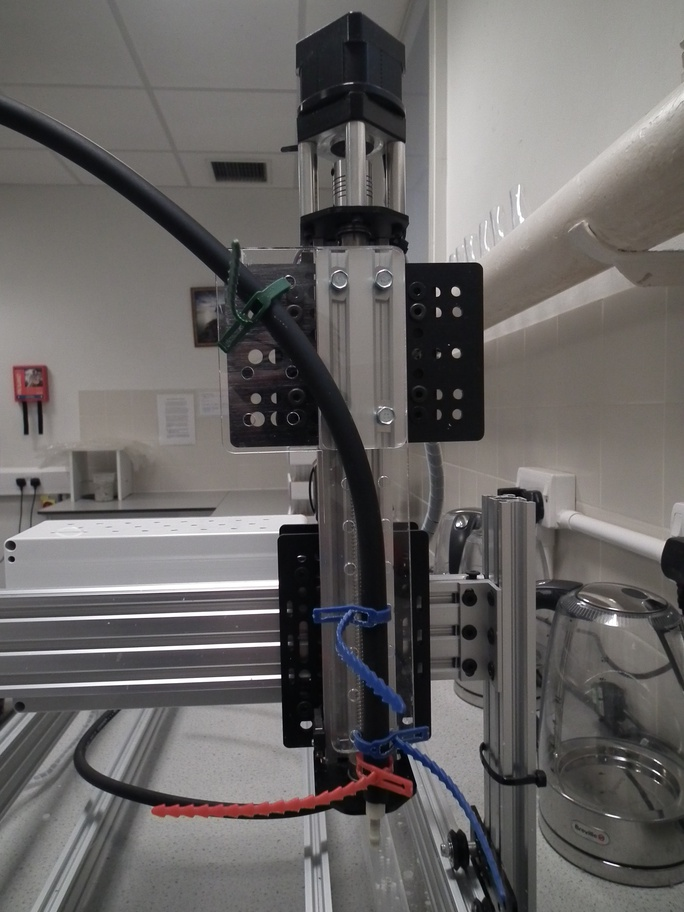
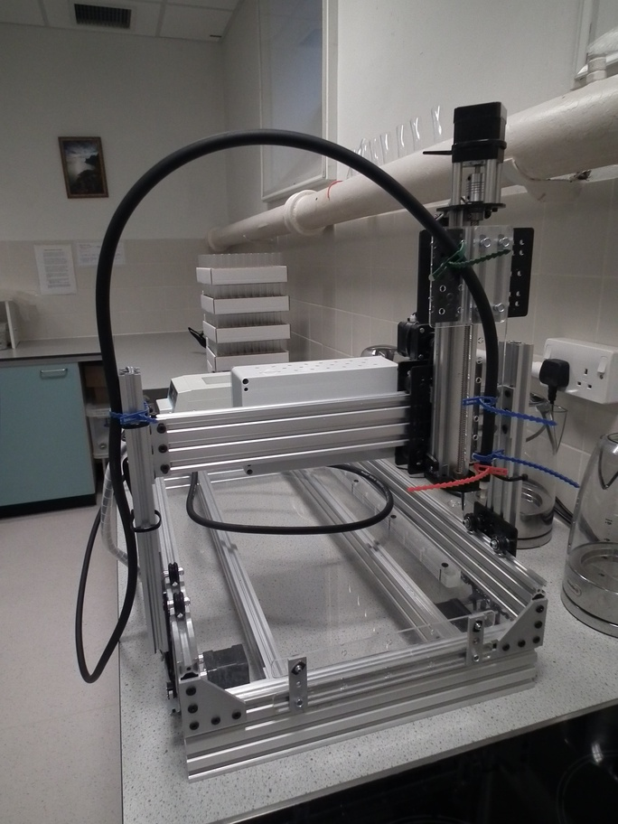
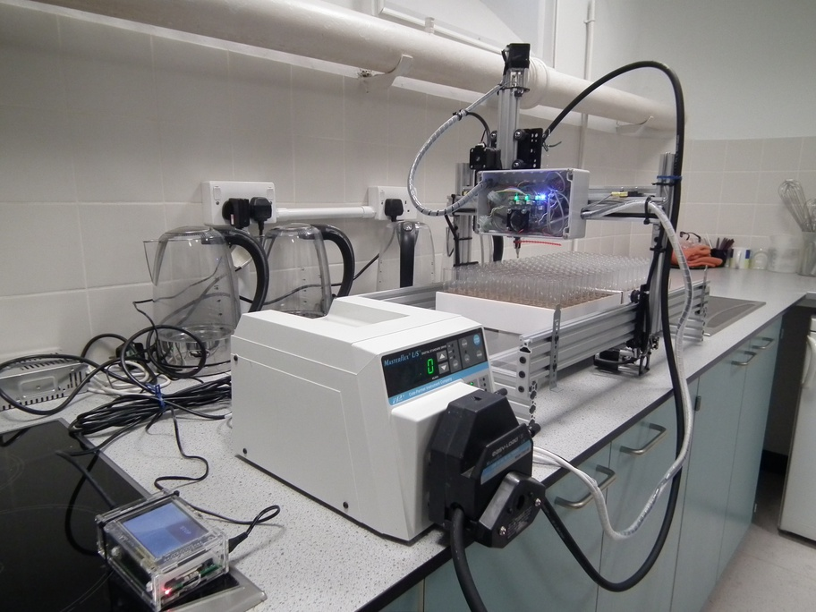
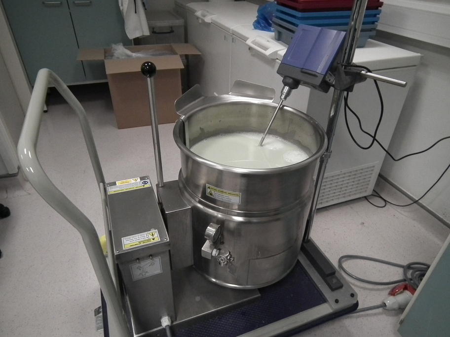
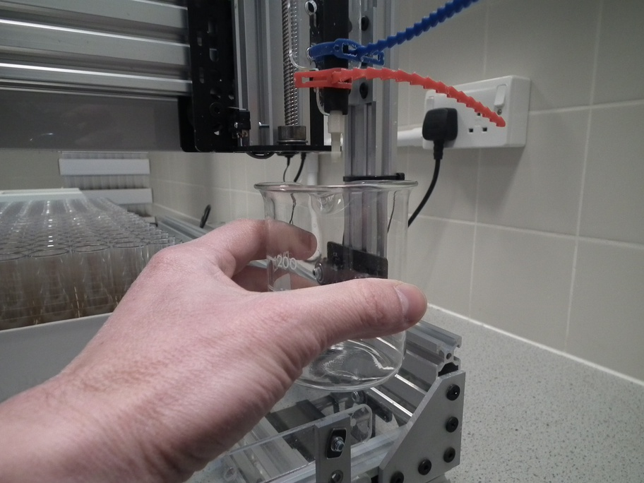
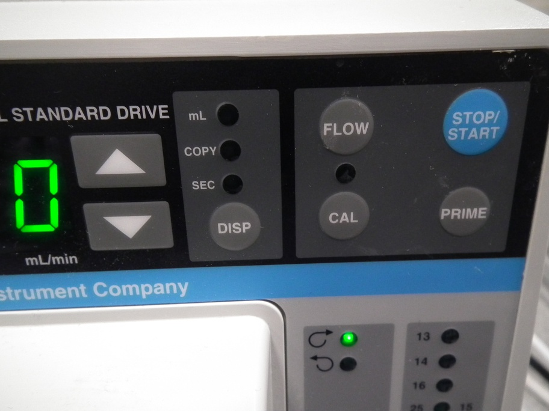

# System start-up {#startup}

## Attach Norprene tubing

1. Attach the nozzle end of the Norprene tubing to the holder on the Z-axis actuator using releasable cable ties (figure \@ref(fig:attachNozzle)).

```{r attachNozzle, echo=FALSE, out.width='75%', fig.align='center', fig.cap="Attachment of nozzle end of tubing to the Z-axis actuator."}

```

2. Attach the Masterflex Norprene tubing to the right-hand side vertical post using a releasable cable tie. Ensure there is a large loop in the tubing between this attachment point and the nozzle so that the x-axis actuator can move freely (figure \@ref(fig:tubingPost))

```{r tubingPost, echo=FALSE, out.width='75%', fig.align='center', fig.cap="Attachment of Norprene tubing to the right-hand side vertical post."}

```

3. Feed the tubing through the peristaltic pump (figure \@ref(fig:tubingPump)) and into your vat of fly food (figure \@ref(fig:flyFoodVat)).

```{r tubingPump, echo=FALSE, out.width='75%', fig.align='center', fig.cap="Norprene tubing passing through peristaltic pump."}

```

```{r flyFoodVat, echo=FALSE, out.width='75%', fig.align='center', fig.cap="Vat of fly food."}

```


## Switch on all devices
 * power supply unit for gShield and motors
 * raspberry pi
 * peristaltic pump
 
## Prime pump 
 * Position a beaker under the nozzle  (figure \@ref(fig:primeBeaker)).
 * Press and hold the prime button on the front of the peristaltic pump until a continuous stream of fly food is pumped into the beaker (figure \@ref(fig:primeButton))

```{r primeBeaker, echo=FALSE, out.width='75%', fig.align='center', fig.cap="Positioning of beaker under nozzle to collect fly food expelled during priming of peristaltic pump."}

```

```{r primeButton, echo=FALSE, out.width='75%', fig.align='center', fig.cap="Prime button on peristaltic pump."}

```

