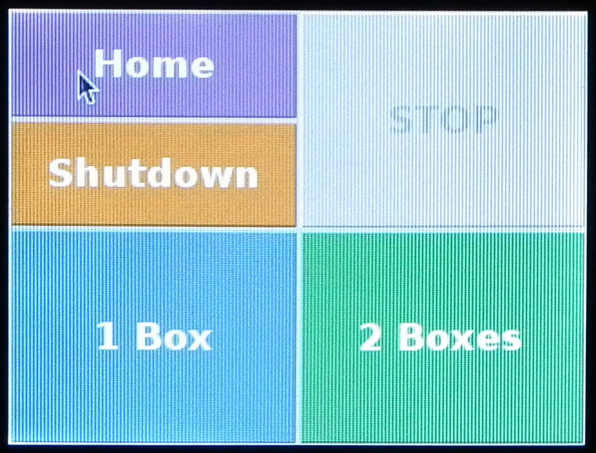
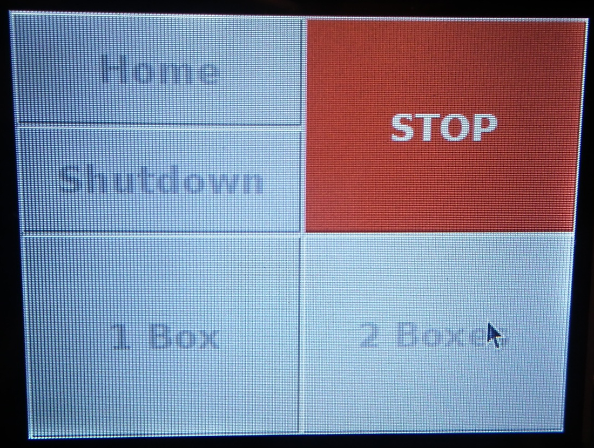

# Operation {#operation}

## Prepare system

1. attach tube and put other end in heated vat of fly food
2. check none of the limit switches are depressed - manually move actuator off limit switch if necessary
2. power up
3. prime pump


## Fill boxes
Check orientation of boxes and check vials aligned

From GUI select fill one or two boxes

Follow instructions in section \@ref(startSystem) to start-up system.


Figure \@ref(fig:loadBoxes2)


```{r touchscreen, echo=FALSE, out.width='60%', fig.align='center', fig.cap="Touchscreen interface."}

```


Figure \@ref(fig:touchscreen)

```{r stopRobot, echo=FALSE, out.width='60%', fig.align='center', fig.cap="Appearance of touchscreen interface when a job is running."}

```

Figure \@ref(fig:stopRobot)
