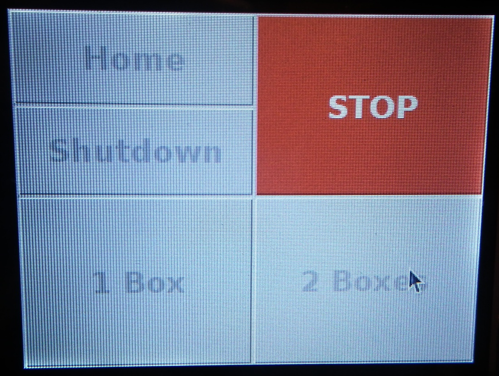

# Routine operation {#operation}

## Prepare system

Instructions for starting the system are provided in section \@ref(startSystem)


## Fill boxes
Load boxes onto platform as described in step 1 of section \@ref(boxCoordinates).

Check orientation of boxes and check vials aligned

From GUI select fill one or two boxes

## Shutdown


```{r touchscreen, echo=FALSE, out.width='60%', fig.align='center', fig.cap="Touchscreen interface."}
knitr::include_graphics("images/gui.jpg")
```


Figure \@ref(fig:touchscreen)

```{r stopRobot, echo=FALSE, out.width='60%', fig.align='center', fig.cap="Appearance of touchscreen interface when a job is running."}

```

Figure \@ref(fig:stopRobot)
