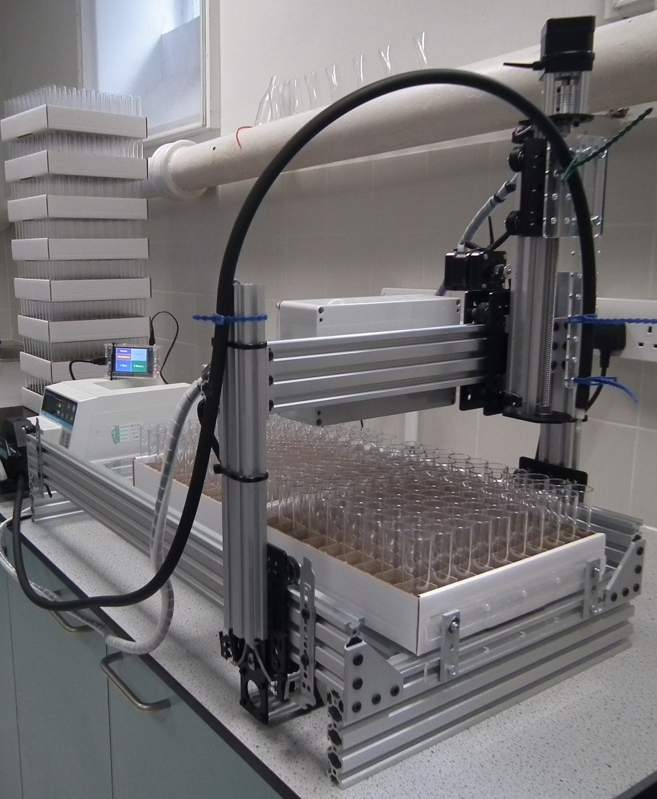

--- 
title: "CNC Fly Food Dispenser"
author: "Matt Wayland"
date: "2017-06-19"
site: bookdown::bookdown_site
output: bookdown::gitbook
documentclass: book
bibliography: [book.bib, packages.bib]
biblio-style: apalike
link-citations: yes
github-repo: bioinformatics-training/intro-machine-learning
description: "Course materials for An Introduction to Machine Learning"
cover-image: images/system.jpg
---


# About

\begin{figure}

{\centering \includegraphics[width=0.75\linewidth]{images/system} 

}

\caption{Robot}(\#fig:test)
\end{figure}


## Overview

Figure \@ref(fig:test)


## Github


## Contact
<a href="mailto:mw283@cam.ac.uk">Matt Wayland</a>


## Colophon

This book was produced using the **bookdown** package [@R-bookdown], which was built on top of R Markdown and **knitr** [@xie2015].

<!--chapter:end:index.Rmd-->

# Introduction {#intro}


The fruit fly, *Drosophila melanogaster*, is one of the most important model organisms in biological research. Maintaining stocks of fruit flies in the laboratory is labour-intensive. One task which lends itself to automation is the production of the vials of food in which the flies are reared. Fly facilities typically have to generate several thousand vials of fly food each week to sustain their fly stocks. The system presented here combines a cartesian coordinate robot with a peristaltic pump. The design of the robot is based on the Routy CNC Router created by Mark Carew (http://openbuilds.org/builds/routy-cnc-router-v-slot-belt-pinion.101/), and uses belt and pully actuators for the X and Y axes, and a leadscrew actuator for the Z axis. CNC motion and operation of the peristaltic pump are controlled by grbl (https://github.com/gnea/grbl), an open source, embedded, high performance g-code parser. Grbl is written in optimized C and runs directly on an Arduino. A Raspberry Pi is used to generate and stream G-code instructions to Grbl. A touch screen on the Raspberry Pi provides a graphical user interface to the system. This manual explains how to install the required software and operate the robot. Instructions for building the hardware are available on [DocuBricks](http://docubricks.com/viewer.jsp?id=8652757760093769728).

A Raspberry Pi is used to generate and stream G-code to the Arduino. A touch screen on the Raspberry Pi provides the user interface; a resistive rather than capacitive touch screen was chosen so that it could be operated by a person wearing gloves.





You can label chapter and section titles using `{#label}` after them, e.g., we can reference Chapter \@ref(intro). If you do not manually label them, there will be automatic labels anyway, e.g., Chapter \@ref(methods).

Figures and tables with captions will be placed in `figure` and `table` environments, respectively.


```r
par(mar = c(4, 4, .1, .1))
plot(pressure, type = 'b', pch = 19)
```

\begin{figure}

{\centering \includegraphics[width=0.8\linewidth]{01-intro_files/figure-latex/nice-fig-1} 

}

\caption{Here is a nice figure!}(\#fig:nice-fig)
\end{figure}

Reference a figure by its code chunk label with the `fig:` prefix, e.g., see Figure \@ref(fig:nice-fig). Similarly, you can reference tables generated from `knitr::kable()`, e.g., see Table \@ref(tab:nice-tab).


```r
knitr::kable(
  head(iris, 20), caption = 'Here is a nice table!',
  booktabs = TRUE
)
```

\begin{table}

\caption{(\#tab:nice-tab)Here is a nice table!}
\centering
\begin{tabular}[t]{rrrrl}
\toprule
Sepal.Length & Sepal.Width & Petal.Length & Petal.Width & Species\\
\midrule
5.1 & 3.5 & 1.4 & 0.2 & setosa\\
4.9 & 3.0 & 1.4 & 0.2 & setosa\\
4.7 & 3.2 & 1.3 & 0.2 & setosa\\
4.6 & 3.1 & 1.5 & 0.2 & setosa\\
5.0 & 3.6 & 1.4 & 0.2 & setosa\\
\addlinespace
5.4 & 3.9 & 1.7 & 0.4 & setosa\\
4.6 & 3.4 & 1.4 & 0.3 & setosa\\
5.0 & 3.4 & 1.5 & 0.2 & setosa\\
4.4 & 2.9 & 1.4 & 0.2 & setosa\\
4.9 & 3.1 & 1.5 & 0.1 & setosa\\
\addlinespace
5.4 & 3.7 & 1.5 & 0.2 & setosa\\
4.8 & 3.4 & 1.6 & 0.2 & setosa\\
4.8 & 3.0 & 1.4 & 0.1 & setosa\\
4.3 & 3.0 & 1.1 & 0.1 & setosa\\
5.8 & 4.0 & 1.2 & 0.2 & setosa\\
\addlinespace
5.7 & 4.4 & 1.5 & 0.4 & setosa\\
5.4 & 3.9 & 1.3 & 0.4 & setosa\\
5.1 & 3.5 & 1.4 & 0.3 & setosa\\
5.7 & 3.8 & 1.7 & 0.3 & setosa\\
5.1 & 3.8 & 1.5 & 0.3 & setosa\\
\bottomrule
\end{tabular}
\end{table}


<!--chapter:end:01-intro.Rmd-->

# Grbl installation and configuration

## Overview

CNC motion control is provided by grbl (https://github.com/gnea/grbl), an open source, embedded, high performance g-code parser. Grbl is written in optimized C and runs directly on an Arduino. This is used in conjunction with the gShield (formerly known as grblshield) which provides the hardware drivers for the stepper motors. Grbl sends out TTL signals on pins A3 and 13 or the Arduino to control coolant flow and spindle direction, respectively. Here these signals are used to remotely control a peristaltic pump. 

## Flashing Grbl to Arduino

To flash Grbl to the Arduino you will need a computer with the latest version of the [Arduino IDE](https://www.arduino.cc/en/Main/Software) installed. The following instructions for flashing Grbl to the Arduino are taken from: https://github.com/gnea/grbl/wiki/Compiling-Grbl

_**NOTE: Before starting, delete prior Grbl library installations from the Arduino IDE. Otherwise, you'll have compiling issues! On a Mac, Arduino libraries are located in ```~/Documents/Arduino/libraries/```. On Windows, it's in ```My Documents\Arduino\libraries```.**_

1. Download the Grbl source code.
 * Open the following page in your web browser: https://github.com/gnea/grbl
 * Click on the ```<>Code``` Tab
 * Click the ```Clone or Download``` green button on the Grbl home page.
 * Click the ```Download ZIP```
 * Unzip the download and you'll have a folder called ```grbl-XXX```, where `XXX` is the release version. 
 
2. Launch the Arduino IDE
 * Make sure you are using the most recent version of the Arduino IDE!
\begin{figure}

{\centering \includegraphics[width=0.75\linewidth]{images/arduino_IDE} 

}

\caption{Arduino IDE}(\#fig:arduinoIDE)
\end{figure}

3. Load Grbl into the Arduino IDE as a Library.
 * Click the ```Sketch``` drop-down menu, navigate to ```Include Library``` and select ```Add .ZIP Library```.
 * **IMPORTANT:** Select the ```Grbl``` folder **_inside_** the ```grbl-XXX``` folder, which **only** contains the source files and an example directory.
\begin{figure}

{\centering \includegraphics[width=0.75\linewidth]{images/add_grbl_lib} 

}

\caption{Loading Grbl library into the Arduino IDE}(\#fig:addGrblLib)
\end{figure}
 * If you accidentally select the `.zip` file or the wrong folder, you will need to navigate to your Arduino library, delete the mistake, and re-do Step 3.
 
4. Open the `GrblUpload` Arduino example.
 * Click the ```File``` drop-down menu, navigate to ```Examples->Grbl```, and select ```GrblUpload```.
\begin{figure}

{\centering \includegraphics[width=0.75\linewidth]{images/grbl_upload_file} 

}

\caption{GrblUpload example file}(\#fig:grblUploadFile)
\end{figure}

5. Compile and upload Grbl to your Arduino.
 * Connect your computer directly to the Arduino using the USB cable.
\begin{figure}

{\centering \includegraphics[width=0.75\linewidth]{images/laptop_connected_to_arduino} 

}

\caption{Laptop connected directly to Arduino}(\#fig:laptop2arduino)
\end{figure}

 * Make sure your board is set to the Arduino Uno in the ```Tool->Board``` menu and the serial port is selected correctly in ```Tool->Serial Port```. 
 * Click the ```Upload```, and Grbl should compile and flash to your Arduino! (Flashing with a programmer also works by using the ```Upload Using Programmer``` menu command.)

## Check serial connection to Grbl

_**NOTE: Before powering up the gShield and motors, check that the actuator carriages for all three axes are approximately centred. Initially we do not know in which direction the actuator carriages will travel when G-code commands are issued, so positioning each in the middle of its range reduces the risk of collisions with the end stops.**_

\begin{figure}

{\centering \includegraphics[width=0.75\linewidth]{images/actuator_carriages_centred} 

}

\caption{Actuator carriages centred in preparation for powering-up motors for first time}(\#fig:actuatorsCentred)
\end{figure}

1. Open serial monitor in Arduino IDE
 * Click ```Tools``` drop-down menu, and select ```Serial Monitor```
\begin{figure}

{\centering \includegraphics[width=0.75\linewidth]{images/Arduino_IDE_serial_monitor} 

}

\caption{Arduino IDE Serial Monitor}(\#fig:serialMonitor)
\end{figure}
 * Note that line-ending is set to ```Carriage return``` and baud rate is set to ```115200```
2. Try issuing a G-code command. 
 * Type ```?``` and hit return. 
 *This command will report the current position; as we have just started the system up all axes will be at 0.000.
3. Now try moving actuators
 * To move in the x-axis type ```x5``` and hit return. Make a note of the direction in which the actuator carriage moves. N.B. this command tells Grbl to move to the x coordinate that is 5 units from the origin, it is not equivalent to telling the robot to move 5 units in the x-axis.
 * To move in the opposite direction along the x-axis type ```x-5``` and hit return.
 * To return to the starting point, use ```x0```
 * Repeat for the other axes, replacing the x in the commands with y or z. Make a note of the direction the actuator carriages move with each command.

## Grbl configuration

### Read current configuration
 * The ```$$``` command will report Grbl's current configuration.
 * Descriptions of these settings can be found here: https://github.com/gnea/grbl/wiki/Grbl-v1.1-Configuration
 * These settings will be modified in subsequent steps.

### Check directionality of each axis.
\begin{figure}

{\centering \includegraphics[width=0.75\linewidth]{images/robot_orientation} 

}

\caption{Orientation of robot.}(\#fig:robotOrientation)
\end{figure}
 * At present the origins of all three axes are mid-way along each actuator, because this was the position of the actuator carriages when the system was started.
 * Make sure actuator carriages are at their current origin by entering this command: ```x0y0z0```
 * Enter the command: ```x5```. The x-axis carriage should move from right to left (orientation of robot is shown in figure \@ref(fig:robotOrientation). If it doesn't, make a note that it will need to be inverted.
 * Enter the command: ```y5```. The y-axis carriage should move forwards. If it doesn't, make a note that it will need to be inverted.
 * Enter the command: ```z5```. The z-axis carriage should move up. If it doesn't, make a note that it will need to be inverted.
 * The direction of the actuators can be inverted using setting **$3**, the [Direction port invert (mask)](https://github.com/gnea/grbl/wiki/Grbl-v1.1-Configuration#3--direction-port-invert-mask). An appropriate value is selected from table \@ref(tab:invertMaskSettings). For example, to invert the direction of the X and Z axis actuators use the following command: ```$3=5```

Table: (\#tab:invertMaskSettings) Masks for direction port inversion.

| Setting Value | Mask |Invert X | Invert Y | Invert Z |
|:-------------:|:----:|:-------:|:--------:|:--------:|
| 0 | 00000000 |N | N | N |
| 1 | 00000001 |Y | N | N |
| 2 | 00000010 |N | Y | N |
| 3 | 00000011 |Y | Y | N |
| 4 | 00000100 |N | N | Y |
| 5 | 00000101 |Y | N | Y |
| 6 | 00000110 |N | Y | Y |
| 7 | 00000111 |Y | Y | Y |

### Activate hard limits
Hard limits are a safety feature to prevent the machine from travelling beyond the limits of travel. Grbl monitors the paired limit switches on each axis and if a switch is triggered it will immediately switch off all motors. Hard limits are activated by setting **$21** [hard limits ( boolean)](https://github.com/gnea/grbl/wiki/Grbl-v1.1-Configuration#21---hard-limits-boolean) to 1: 
```
$21=1
```

### Setup homing
The homing cycle is used to set the origin of the cartesian coordinate system used by the robot. During the homing cycle Grbl moves each actuator in the positive direction until the limit switches are triggered. The homing cycle is activated by setting **$22** [homing cycle (boolean)](https://github.com/gnea/grbl/wiki/Grbl-v1.1-Configuration#22---homing-cycle-boolean) to 1: 
```
$22=1
```

Initiate  a homing cycle using the following command: ```$h```. All actuator carriages should move to the origin of their axes. The origin of the cartesian coordinate system (home) for the robot is shown in figures \@ref(fig:xyOrigin) and \@ref(fig:zOrigin)

\begin{figure}

{\centering \includegraphics[width=0.75\linewidth]{images/xy_origin} 

}

\caption{Origin of XY coordinate system.}(\#fig:xyOrigin)
\end{figure}
\begin{figure}

{\centering \includegraphics[width=0.75\linewidth]{images/z_origin} 

}

\caption{Origin of Z axis.}(\#fig:zOrigin)
\end{figure}

We also need to set **$24** [homing feed rate](https://github.com/gnea/grbl/wiki/Grbl-v1.1-Configuration#24---homing-feed-mmmin) and **$25** [homing seek rate](https://github.com/gnea/grbl/wiki/Grbl-v1.1-Configuration#25---homing-seek-mmmin). Homing seek rate is the initial speed at which Grbl searches for the limit switches. Once it has them, it makes slower approach at the homing feed rate to get a more precise location for machine zero. We will set homing seek rate to 1000 mm/min ```$24=100``` and homing feed rate to 100 mm/min ```$25=1000```.

At the end of a homing cycle each actuator carriage must be moved off its home limit switch, otherwise the hard limit will be triggered. 
The **$27** [Homing pull-off (mm)](https://github.com/gnea/grbl/wiki/Grbl-v1.1-Configuration#27---homing-pull-off-mm) specifies the distance required to clear the limit switches. For our robot we will use a value of 5mm:
```
$27=5
```

### Motor step size
**$100**, **$101** and **$102** define [[X,Y,Z] steps/mm](https://github.com/gnea/grbl/wiki/Grbl-v1.1-Configuration#100-101-and-102--xyz-stepsmm).
Suitable values for our stepper motors are:
```
$100=40
$101=40
$102=49.673
```

curr_steps_per_mm = steps/mm in current configuration
start_pos_grbl = starting position reported by software
end_pos_grbl = end position reported by software
start_pos_physical = actual/physical start position
end_pos_physical = actual/physical end position

steps/mm = (curr_steps_per_mm * (end_pos_grbl-start_pos_grbl)) / (end_pos_physical - start_pos_physical)


### Feed rates and acceleration
**$110**, **$111** and **$112** set the [maximum rates (mm/min)](https://github.com/gnea/grbl/wiki/Grbl-v1.1-Configuration#110-111-and-112--xyz-max-rate-mmmin) for the X, Y and Z actuators, respectively. We will use the following values:
```
$110=5000
$111=5000
$112=2500
```

[Acceleration (mm/sec^2)](https://github.com/gnea/grbl/wiki/Grbl-v1.1-Configuration#120-121-122--xyz-acceleration-mmsec2) is set to 50 for all axes:
```
$120=50
$121=50
$122=50
```

### Summary of settings
```
$0=10
$1=25
$2=0
$3=5
$4=0
$5=0
$6=0
$10=1
$11=0.010
$12=0.002
$13=0
$20=0
$21=1
$22=1
$23=0
$24=25.000
$25=500.000
$26=250
$27=5.000
$30=1000
$31=0
$32=0
$100=40.000
$101=40.000
$102=49.673
$110=5000.000
$111=5000.000
$112=2500.000
$120=50.000
$121=50.000
$122=50.000
$130=200.000
$131=200.000
$132=200.000
```


## fine adjustment of motors

<!--chapter:end:02-grbl.Rmd-->

# Raspberry Pi setup

https://learn.adafruit.com/adafruit-pitft-28-inch-resistive-touchscreen-display-raspberry-pi/easy-install

https://s3.amazonaws.com/adafruit-raspberry-pi/2016-10-18-pitft-28r.zip


https://www.raspberrypi.org/documentation/installation/installing-images/


```
    sudo raspi-config
    (expand filesystem)
    sudo reboot
```
    
/etc/dhcpcd.conf

interface eth0

static ip_address=192.168.2.2/24
static routers=192.168.2.1
static domain_name_servers=192.168.2.1


<!--chapter:end:03-raspi-setup.Rmd-->

# Creating jobs in G-code

Running job without GUI - for testing

<!--chapter:end:04-g-code.Rmd-->

# Trouble-shooting

<!--chapter:end:05-operation.Rmd-->


<!--chapter:end:06-references.Rmd-->

