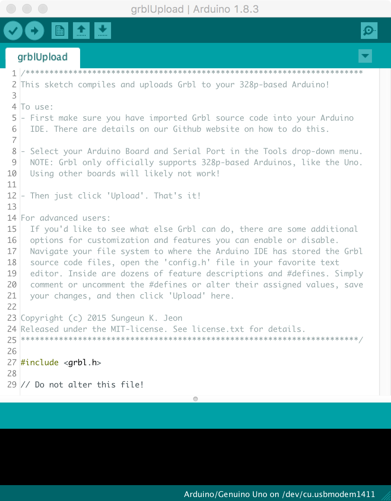
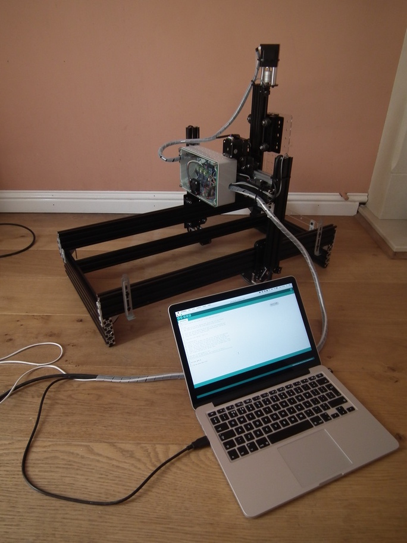
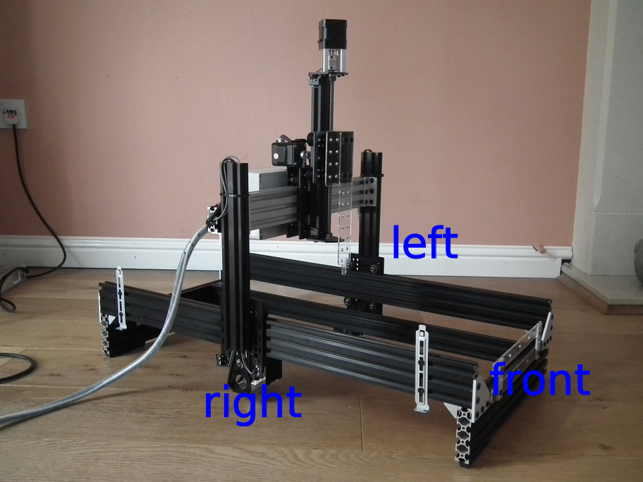
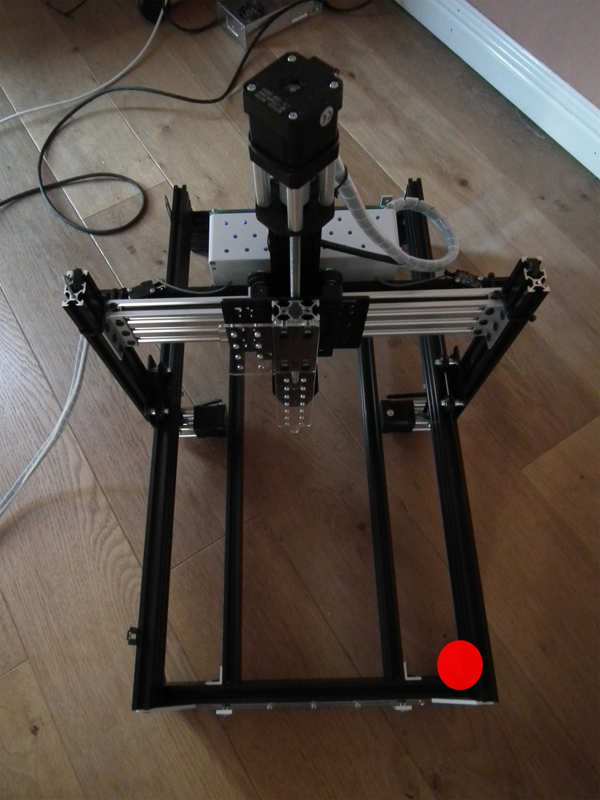
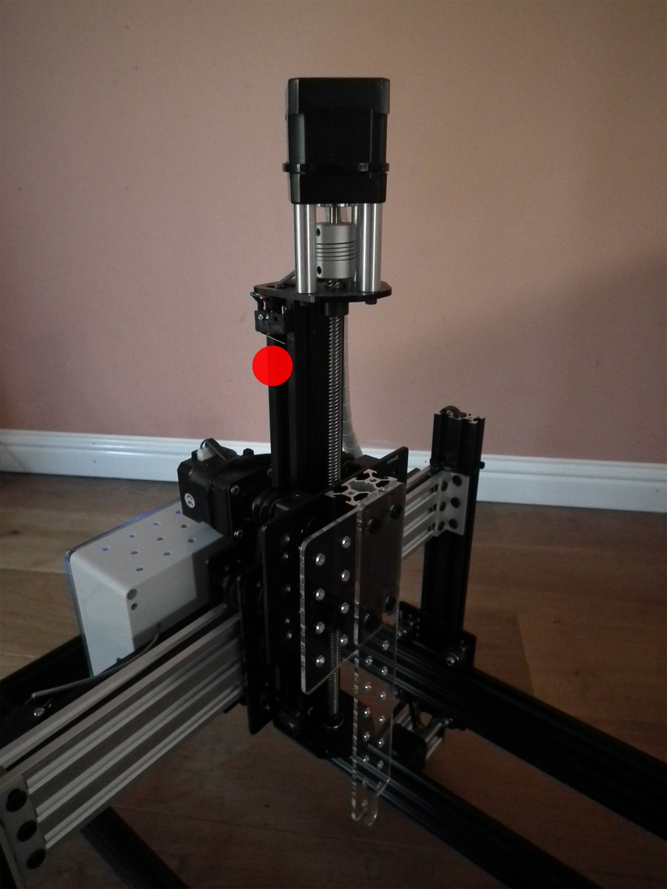

# Grbl installation and configuration {#grbl}

## Overview

CNC motion control is provided by grbl (https://github.com/gnea/grbl), an open source, embedded, high performance g-code parser. Grbl is written in optimized C and runs directly on an Arduino. This is used in conjunction with the gShield (formerly known as grblshield) which provides the hardware drivers for the stepper motors. Grbl sends out TTL signals on pins A3 and 13 of the Arduino to control coolant flow and spindle direction, respectively. Here these signals are used to remotely control a peristaltic pump. 

## Flashing Grbl to Arduino

To flash Grbl to the Arduino you will need a computer with the latest version of the [Arduino IDE](https://www.arduino.cc/en/Main/Software) installed. The following instructions for flashing Grbl to the Arduino are taken from: https://github.com/gnea/grbl/wiki/Compiling-Grbl

_**NOTE: Before starting, delete prior Grbl library installations from the Arduino IDE. Otherwise, you'll have compiling issues! On a Mac, Arduino libraries are located in ```~/Documents/Arduino/libraries/```. On Windows, it's in ```My Documents\Arduino\libraries```.**_

1. Download the Grbl source code.
 * Open the following page in your web browser: https://github.com/gnea/grbl
 * Click on the ```<>Code``` Tab
 * Click the ```Clone or Download``` green button on the Grbl home page.
 * Click the ```Download ZIP```
 * Unzip the download and you'll have a folder called ```grbl-XXX```, where `XXX` is the release version. 

2. Launch the Arduino IDE
 * Make sure you are using the most recent version of the Arduino IDE!

<div class="figure" style="text-align: center">

<p class="caption">(\#fig:arduinoIDE)Arduino IDE</p>
</div>

3. Load Grbl into the Arduino IDE as a Library.
 * Click the ```Sketch``` drop-down menu, navigate to ```Include Library``` and select ```Add .ZIP Library```.
 * **IMPORTANT:** Select the ```Grbl``` folder **_inside_** the ```grbl-XXX``` folder, which **only** contains the source files and an example directory.
 
<div class="figure" style="text-align: center">

<p class="caption">(\#fig:addGrblLib)Loading Grbl library into the Arduino IDE</p>
</div>

 * If you accidentally select the `.zip` file or the wrong folder, you will need to navigate to your Arduino library, delete the mistake, and re-do Step 3.
 
4. Open the `GrblUpload` Arduino example.
 * Click the ```File``` drop-down menu, navigate to ```Examples->Grbl```, and select ```GrblUpload```.

<div class="figure" style="text-align: center">

<p class="caption">(\#fig:grblUploadFile)GrblUpload example file</p>
</div>

5. Compile and upload Grbl to your Arduino.
 * Connect your computer directly to the Arduino using the USB cable.

<div class="figure" style="text-align: center">

<p class="caption">(\#fig:laptop2arduino)Laptop connected directly to Arduino</p>
</div>

 * Make sure your board is set to the Arduino Uno in the ```Tool->Board``` menu and the serial port is selected correctly in ```Tool->Serial Port```. 
 * Click the ```Upload```, and Grbl should compile and flash to your Arduino! (Flashing with a programmer also works by using the ```Upload Using Programmer``` menu command.)

## Check serial connection to Grbl

_**NOTE: Before powering up the gShield and motors, check that the actuator carriages for all three axes are approximately centred. Initially we do not know in which direction the actuator carriages will travel when G-code commands are issued, so positioning each in the middle of its range reduces the risk of collisions with the end stops.**_

<div class="figure" style="text-align: center">

<p class="caption">(\#fig:actuatorsCentred)Actuator carriages centred in preparation for powering-up motors for first time</p>
</div>

1. Open serial monitor in Arduino IDE
 * Click ```Tools``` drop-down menu, and select ```Serial Monitor```

<div class="figure" style="text-align: center">

<p class="caption">(\#fig:serialMonitor)Arduino IDE Serial Monitor</p>
</div>

 * Note that line-ending is set to ```Carriage return``` and baud rate is set to ```115200```
2. Try issuing a G-code command. 
 * Type ```?``` and hit return. 
 * This command will report the current position; as we have just started the system up all axes will be at 0.000.
3. Now try moving actuators
 * To move in the x-axis type ```x5``` and hit return. Make a note of the direction in which the actuator carriage moves. N.B. this command tells Grbl to move to the x coordinate that is 5 units from the origin, it is not equivalent to telling the robot to move 5 units in the x-axis.
 * To move in the opposite direction along the x-axis type ```x-5``` and hit return.
 * To return to the starting point, use ```x0```
 * Repeat for the other axes, replacing the x in the commands with y or z. Make a note of the direction the actuator carriages move with each command.

## Grbl configuration

### Read current configuration
 * The ```$$``` command will report Grbl's current configuration.
 * Descriptions of these settings can be found here: https://github.com/gnea/grbl/wiki/Grbl-v1.1-Configuration
 * These settings will be modified in subsequent steps.

### Check directionality of each axis.

<div class="figure" style="text-align: center">

<p class="caption">(\#fig:robotOrientation)Orientation of robot.</p>
</div>

 * At present the origins of all three axes are mid-way along each actuator, because this was the position of the actuator carriages when the system was started.
 * Make sure actuator carriages are at their current origin by entering this command: ```x0y0z0```
 * Enter the command: ```x5```. The x-axis carriage should move from right to left (orientation of robot is shown in figure \@ref(fig:robotOrientation). If it doesn't, make a note that it will need to be inverted.
 * Enter the command: ```y5```. The y-axis carriage should move forwards. If it doesn't, make a note that it will need to be inverted.
 * Enter the command: ```z5```. The z-axis carriage should move up. If it doesn't, make a note that it will need to be inverted.
 * The direction of the actuators can be inverted using setting **$3**, the [Direction port invert (mask)](https://github.com/gnea/grbl/wiki/Grbl-v1.1-Configuration#3--direction-port-invert-mask). An appropriate value is selected from table \@ref(tab:invertMaskSettings). For example, to invert the direction of the X and Z axis actuators use the following command: ```$3=5```

<!---
Table: (\#tab:invertMaskSettings) Masks for direction port inversion.

| Setting Value | Mask |Invert X | Invert Y | Invert Z |
|:-------------:|:----:|:-------:|:--------:|:--------:|
| 0 | 00000000 |N | N | N |
| 1 | 00000001 |Y | N | N |
| 2 | 00000010 |N | Y | N |
| 3 | 00000011 |Y | Y | N |
| 4 | 00000100 |N | N | Y |
| 5 | 00000101 |Y | N | Y |
| 6 | 00000110 |N | Y | Y |
| 7 | 00000111 |Y | Y | Y |

 --->

Table: (\#tab:invertMaskSettings)Masks for direction port inversion.

Setting Value   Mask       Invert X   Invert Y   Invert Z 
--------------  ---------  ---------  ---------  ---------
0               00000000   N          N          N        
1               00000001   Y          N          N        
2               00000010   N          Y          N        
3               00000011   Y          Y          N        
4               00000100   N          N          Y        
5               00000101   Y          N          Y        
6               00000110   N          Y          Y        
7               00000111   Y          Y          Y        

### Activate hard limits
Hard limits are a safety feature to prevent the machine from travelling beyond the limits of travel. Grbl monitors the paired limit switches on each axis and if a switch is triggered it will immediately switch off all motors. Hard limits are activated by setting **$21** [hard limits ( boolean)](https://github.com/gnea/grbl/wiki/Grbl-v1.1-Configuration#21---hard-limits-boolean) to 1: 
```
$21=1
```

### Setup homing
The homing cycle is used to set the origin of the cartesian coordinate system used by the robot. During the homing cycle Grbl moves each actuator in the positive direction until the limit switches are triggered. The homing cycle is activated by setting **$22** [homing cycle (boolean)](https://github.com/gnea/grbl/wiki/Grbl-v1.1-Configuration#22---homing-cycle-boolean) to 1: 
```
$22=1
```

Initiate  a homing cycle using the following command: ```$h```. All actuator carriages should move to the origin of their axes. The origin of the cartesian coordinate system (home) for the robot is shown in figures \@ref(fig:xyOrigin) and \@ref(fig:zOrigin)

<div class="figure" style="text-align: center">

<p class="caption">(\#fig:xyOrigin)Origin of XY coordinate system.</p>
</div>

<div class="figure" style="text-align: center">

<p class="caption">(\#fig:zOrigin)Origin of Z axis.</p>
</div>

We also need to set **$24** [homing feed rate](https://github.com/gnea/grbl/wiki/Grbl-v1.1-Configuration#24---homing-feed-mmmin) and **$25** [homing seek rate](https://github.com/gnea/grbl/wiki/Grbl-v1.1-Configuration#25---homing-seek-mmmin). Homing seek rate is the initial speed at which Grbl searches for the limit switches. Once it has them, it makes slower approach at the homing feed rate to get a more precise location for machine zero. We will set homing seek rate to 1000 mm/min ```$24=100``` and homing feed rate to 100 mm/min ```$25=1000```.

At the end of a homing cycle each actuator carriage must be moved off its home limit switch, otherwise the hard limit will be triggered. 
The **$27** [Homing pull-off (mm)](https://github.com/gnea/grbl/wiki/Grbl-v1.1-Configuration#27---homing-pull-off-mm) specifies the distance required to clear the limit switches. For our robot we will use a value of 5mm:
```
$27=5
```


### Motor step size
**$100**, **$101** and **$102** define [[X,Y,Z] steps/mm](https://github.com/gnea/grbl/wiki/Grbl-v1.1-Configuration#100-101-and-102--xyz-stepsmm).
Suitable values for our stepper motors are:
```
$100=40
$101=40
$102=49.673
```

If you are using a different type of stepper motor, the step size can be easily calculated by measuring how far each actuator moves in response to a G-code command. For example, we would calculate the step size for the X actuator as follows.

1. Using the serial monitor in the Arduino IDE, issue the following command to *home* the machine:
```
$h
```

2. Read the current position of the machine, as reported by the Grbl controller:
```
?
```
After homing the cartesian coordinates should be zero minus the homing pull-off:
* x = -5
* y = -5
* z = -5


3. Make a note of the physical position of the nozzle.

4. Issue a g-code command to move to the -100mm position on the x-axis:
```
x-100
```
Keep decreasing the value of x until the x-actuator carriage almost meets the limit switch on the right hand side of the machine. The greater the distance moved, the more precise our calculation of step-size will be.

5. Query Grbl's machine coordinates:
```
?
```

6. Measure the physical distance travelled along the x-axis in millimetres.

7. Find **$100**, the currently configured step size for the x-axis:
```
$$
```

8. Calculate the correct value for step-size:

```
current_step_size = steps/mm in current configuration
grbl_start = start position reported by Grbl controller (mm)
grbl_end = end position reported by Grbl controller (mm)
physical_distance = physical distance moved by actuator (mm)

steps/mm = -(curr_steps_per_mm * (end_pos_grbl-start_pos_grbl)) / physical_distance
```


### Feed rates and acceleration
**$110**, **$111** and **$112** set the [maximum rates (mm/min)](https://github.com/gnea/grbl/wiki/Grbl-v1.1-Configuration#110-111-and-112--xyz-max-rate-mmmin) for the X, Y and Z actuators, respectively. We will use the following values:
```
$110=5000
$111=5000
$112=2500
```

[Acceleration (mm/sec^2)](https://github.com/gnea/grbl/wiki/Grbl-v1.1-Configuration#120-121-122--xyz-acceleration-mmsec2) is set to 50 for all axes:
```
$120=50
$121=50
$122=50
```


### Summary of settings
```
$0=10
$1=25
$2=0
$3=5
$4=0
$5=0
$6=0
$10=1
$11=0.010
$12=0.002
$13=0
$20=0
$21=1
$22=1
$23=0
$24=100.000
$25=1000.000
$26=250
$27=5.000
$30=1000
$31=0
$32=0
$100=40.000
$101=40.000
$102=49.673
$110=5000.000
$111=5000.000
$112=2500.000
$120=50.000
$121=50.000
$122=50.000
$130=200.000
$131=500.000
$132=200.000
```

## Setting motor current

The gShield has trimpots for adjusting the motor current of each axis, as shown in Figure \@ref(fig:gShield).

<div class="figure" style="text-align: center">

<p class="caption">(\#fig:gShield)gShield trimpots</p>
</div>

Instructions for setting motor current are provided here:
https://github.com/synthetos/grblShield/wiki/Using-grblShield#setting-motor-current
