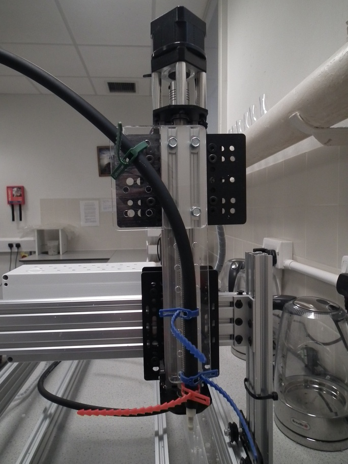
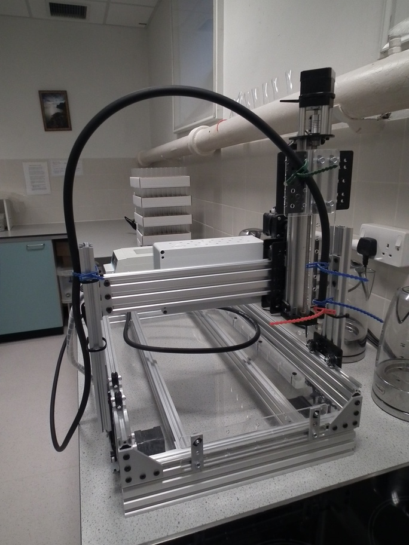
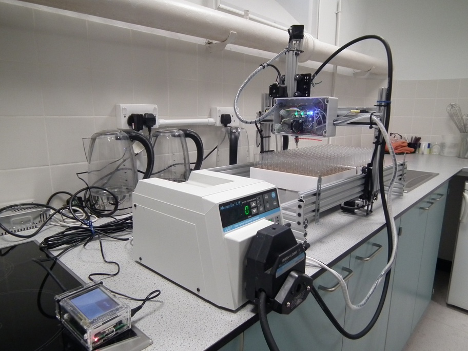
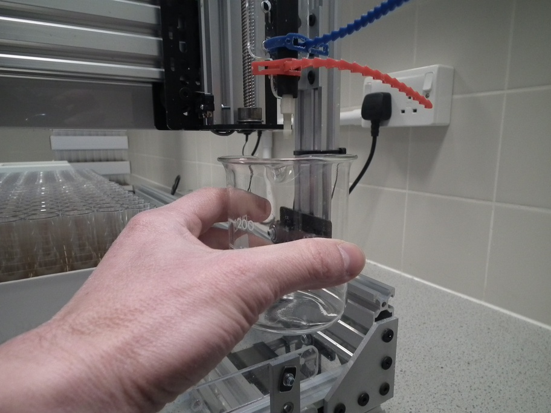
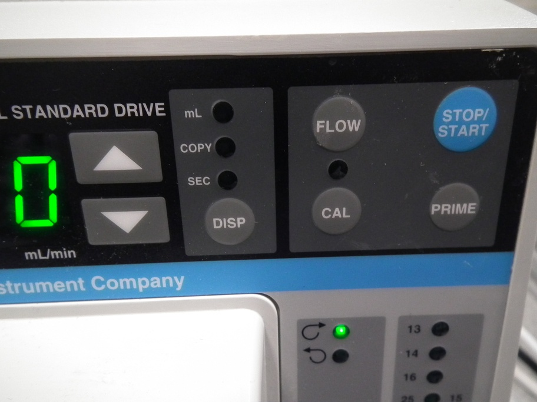
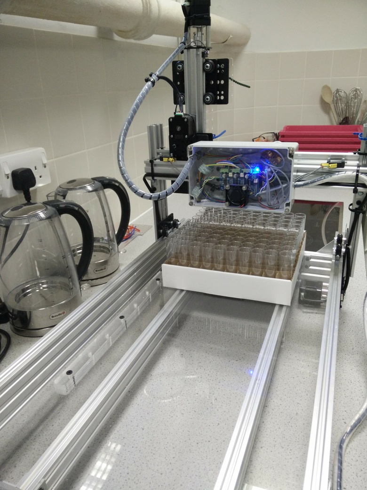
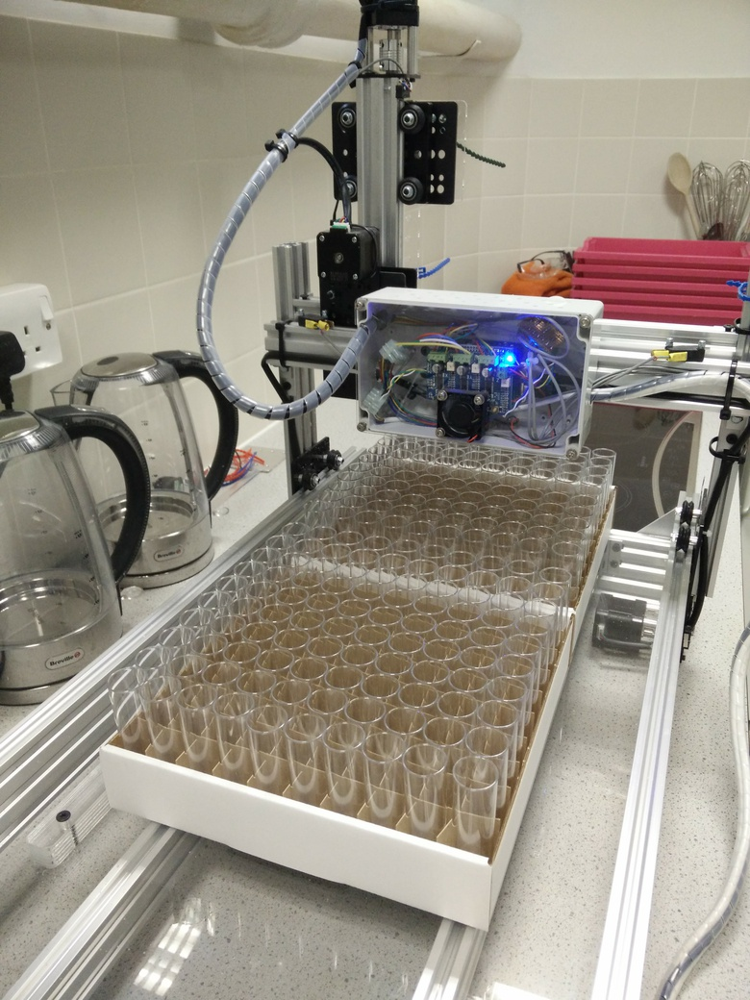
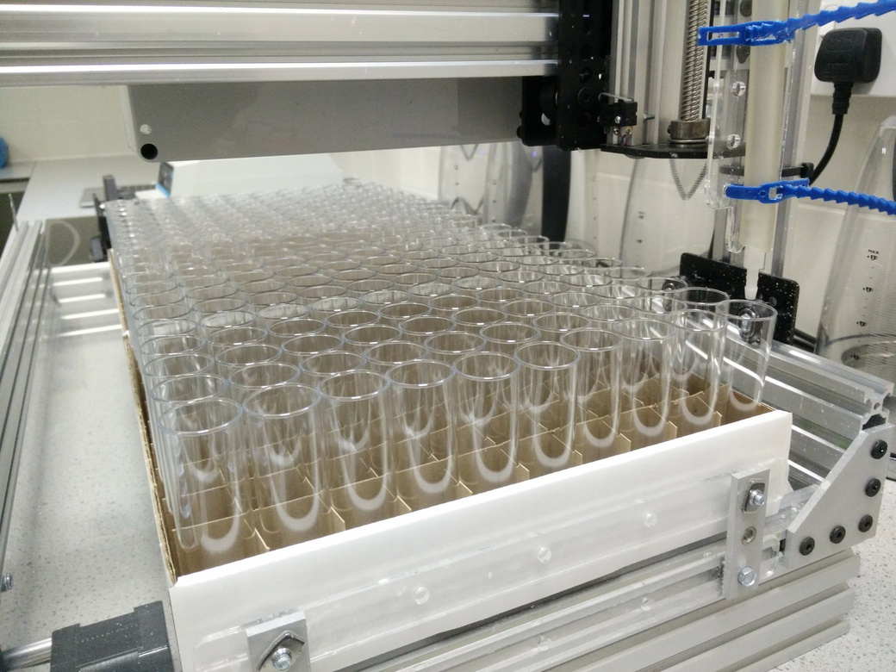
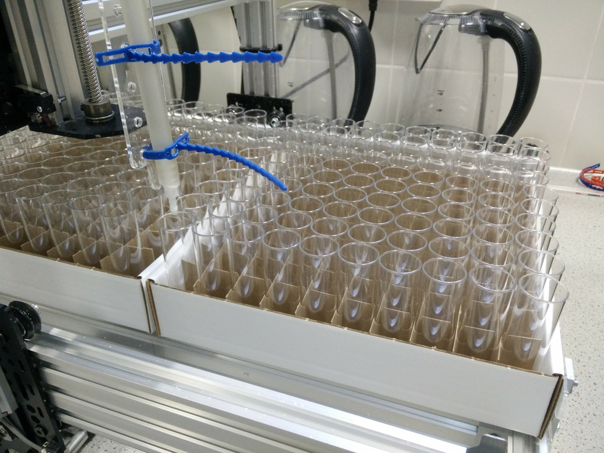
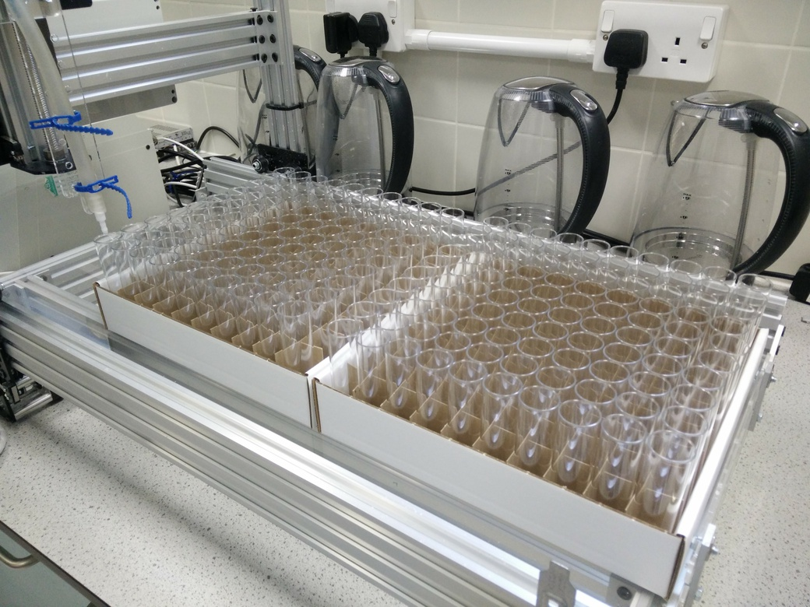

# Program robot to fill vials {#gcode}

Running job without GUI - for testing

<!--
# need 8-9 ml
# pump speed 1800ml/min
# ml/s = 1800/60 = 30
# fill time = 0.3
-->


<!--
ssh pi@192.168.1.3

sudo minicom -D /dev/ttyACM0 -b115200

?<Idle|MPos:-5.000,-5.000,-4.993|FS:0,0|Ov:100,100,100>

x-10 y-10 z-10
ok
?<Idle|MPos:-10.000,-10.000,-10.005|FS:0,0>


x-20 y-20 z-30
ok
?<Idle|MPos:-20.000,-20.000,-29.996|FS:0,0>


x-8 y-14 z-62
ok
?<Idle|MPos:-8.000,-14.000,-62.006|FS:0,0>


./robot/py/calibrate_pump.py

./robot/py/stream2.py robot/nc/calibrate_pump.nc /dev/ttyACM0

./robot/py/fill_boxes.py

-->

## Overview
The movement of the robot is programmed in [G-code](https://en.wikipedia.org/wiki/G-code). We only need nine G-code commands to control the robot (table \@ref(tab:gCodes)).


Table: (\#tab:gCodes)G-code commands used to control robot.

Code   Description                                        
-----  ---------------------------------------------------
x      absolute position of x-axis                        
y      absolute position of y-axis                        
z      absolute position of z-axis                        
g4     dwell time (control parameter p specifies seconds) 
m3     set pump rotation to clockwise                     
m4     set pump rotation to counter clockwise             
m8     start pump                                         
m9     stop pump                                          
$h     initiate homing cycle                              

A G-code program for filling vials of food could be created manually, by listing the necessary commands sequentially in a text file.  However, this would be laborious and error prone. If the size of the boxes of vials are known, the G-code can be programmatically generated. 

## Start system {#startSystem}

1. Attach the nozzle end of the Norprene tubing to the holder on the Z-axis actuator using releasable cable ties (figure \@ref(fig:attachNozzle)).

<div class="figure" style="text-align: center">

<p class="caption">(\#fig:attachNozzle)Attachment of nozzle end of tubing to the Z-axis actuator.</p>
</div>

2. Attach the Masterflex Norprene tubing to the right-hand side vertical post using a releasable cable tie. Ensure there is a large loop in the tubing between this attachment point and the nozzle so that the x-axis actuator can move freely (figure \@ref(fig:tubingPost))

<div class="figure" style="text-align: center">

<p class="caption">(\#fig:tubingPost)Attachment of Norprene tubing to the right-hand side vertical post.</p>
</div>

3. Feed the tubing through the peristaltic pump (figure \@ref(fig:tubingPump)) and into your vat of fly food (figure \@ref(fig:flyFoodVat)).

<div class="figure" style="text-align: center">

<p class="caption">(\#fig:tubingPump)Norprene tubing passing through peristaltic pump.</p>
</div>

<div class="figure" style="text-align: center">

<p class="caption">(\#fig:flyFoodVat)Vat of fly food.</p>
</div>


4. Switch on all devices: 
 * power supply unit for gShield and motors
 * raspberry pi
 * peristaltic pump
 
5. Prime pump 
 * Position a beaker under the nozzle  (figure \@ref(fig:primeBeaker)).
 * Press and hold the prime button on the front of the peristaltic pump until a continuous stream of fly food is pumped into the beaker (figure \@ref(fig:primeButton))

<div class="figure" style="text-align: center">

<p class="caption">(\#fig:primeBeaker)Positioning of beaker under nozzle to collect fly food expelled during priming of peristaltic pump.</p>
</div>

<div class="figure" style="text-align: center">

<p class="caption">(\#fig:primeButton)Prime button on peristaltic pump.</p>
</div>


## Determine box coordinates {#boxCoordinates}

<div class="figure" style="text-align: center">

<p class="caption">(\#fig:loadBoxes2)Loading boxes of vials.</p>
</div>


First we need to determine the Cartesian coordinates of vials in diagonally opposite corners of each box.

1. Load boxes onto the platform of the robot (figure \@ref(fig:loadBoxes2)).
 * The first box should be flush with the fence and the guide rail.
 * The second box should be flush with the first and the guide rail.
 * The boxes we are using have a pair of double-thickness side-walls and a pair of single-thickness side-walls. The pairs are on opposite sides of the box. With this type of box it is important to note the orientation of the boxes when the Cartesian coordinates of the vials are determined, because the same orientation must be used when filling vials with food. We load the boxes with a double-thickness side-wall facing forwards.

2. Login to raspberry pi using ssh. My raspberry pi has the IP address 192.168.1.3 and so I would use:
* ``` ssh pi@192.168.1.3 ```
* Default password for the **pi** user account is 'raspberry'.

3. Use minicom to connect to the Grbl controller running on the Arduino, so that we can interactively control the robot from the command line:
```
sudo minicom -D /dev/ttyACM0 -b115200
```

4. Make sure nozzle is at ** home ** position by issuing homing command:
```
$h
```

5. First we will determine the Cartesian coordinates of the vial in the front left corner of the first box.

* Make small movements in X and Y until the nozzle is centred over this vial, *e.g.*:
```
x-8 y-8
```

* Lower the nozzle in small increments until it is just 2-3mm above the the top of the vial (figure \@ref(fig:box1FrontLeft)), *e.g.*:
```
z-20
```

* Query the current X, Y and Z coordinates by issuing the following command:
```
?
```
Make a note of all three coordinates. 


<div class="figure" style="text-align: center">

<p class="caption">(\#fig:box1FrontLeft)Nozzle positioned over the front left vial in box 1.</p>
</div>

6. Issue G-code commands to move the nozzle laterally until it is over the back right vial of the first box (figure \@ref(fig:box1BackRight)).

<div class="figure" style="text-align: center">

<p class="caption">(\#fig:box1BackRight)Nozzle positioned over the back right vial in box 1.</p>
</div>
* Use ```?``` command to query nozzle position, and make a note of the X and Y coordinates:

7. Move the nozzle laterally until it is over the front left vial of the second box (figure \@ref(fig:box2FrontLeft)), then record X and Y coordinates.

<div class="figure" style="text-align: center">

<p class="caption">(\#fig:box2FrontLeft)Nozzle positioned over the front left vial in box 2.</p>
</div>

8. Finally determine the X and Y coordinates of the back right vial in the second box (figure \@ref(fig:box2BackRight)).

<div class="figure" style="text-align: center">

<p class="caption">(\#fig:box2BackRight)Nozzle positioned over the back right vial in box 2.</p>
</div>


## Calibrate pump
<!--
# need 8-9 ml
# pump speed 1800ml/min
# ml/s = 1800/60 = 30
# fill time = 0.3
-->
The peristaltic pump is started and stopped using the ```m8``` and ```m9``` G-code commands, respectively (table \@ref(tab:gCodes)). To maximize speed, the pump will be run at its maximum flow rate of 30ml/second. In our fly facility, we add 9ml of food to each vial, therefore based on the maximum flow rate, we should only need to run the pump for 0.3 seconds to dispense 9ml of food. However, there is latency in the system and the pump does not reach its maximum flow rate instantaneously on activation. Therefore, it is important to determine the *fill time* empirically. We do this by programming the robot to test fill a single box of vials using a range of *fill times*. The **calibrate_pump.py** script downloaded to the Raspberry Pi in stage \@ref(installScripts) can be used to generate the appropriate G-code program. 

1. Open **calibrate_pump.py** for editing:
```
sudo nano /home/pi/robot/py/calibrate_pump.py
```

2. Near the top of the file (line 32 onwards) are various settings to be modified:

``` 

# SETTINGS

# filename
filename = '/home/pi/robot/nc/calibrate_pump.nc'

# home/datum + homing pull-off (mm) (value of Grbl setting $27)
x_home = -5
y_home = -5
z_home = -5

# z value providing minimal clearance between nozzle and top of vials
z_fill = -62 

# peristaltic pump settings
min_fill_time = 0.3
max_fill_time = 0.6
# pause to allow for drips before moving to next vial
drip_pause = 0.1 

# vial coordinates (x,y)
frontLeft = (-8,-14)
backRight = (-236,-240)

nrows=10
ncols=10
```

* The **filename** is the full path to the G-code file that will be generated by the python script. 
* The parameters **x_home, y_home** and **z_home** are the Cartesian coordinates of the home position (*i.e.* home/datum + homing pull-off (mm)). 
* Modify **z_fill** to the appropriate nozzle height for filling vials (this was determined in step 5 of section \@ref(boxCoordinates)). 
* The **min_fill_time** should be set to our estimate of *fill time* based on the pump's specified flow rate. We will set **max_fill_time** to twice the value of **min_fill_time**.
* The vial coordinates (**frontLeft** and **frontRight**) are those determined for the front left and back right vials in the first box (refer to steps 5 and 6 of section \@ref(boxCoordinates)). 
* Our boxes have ten rows, each containing ten vials, so we set **nrows** and **ncols** to 10.

3. After editing the settings in **calibrate_pump.py**, run the script to generate a G-code program:
```
./robot/py/calibrate_pump.py
```
This will generate a G-code program: **/home/pi/robot/nc/calibrate_pump.nc** which will iteratively increase the fill time for each successive row of vials. The **min_fill_time** will be used for the first row of vials and the fill time will be increased by (**max_fill_time** - **min_fill_time**) / (**nrows** - 1.0) for each successive row (*e.g.* table \@ref(tab:calibrationFillTimes)). Note that the fill times are rounded to the nearest 100th of a second. The fill time for each row is listed in the comments at the top of the **/home/pi/robot/nc/calibrate_pump.nc** file; to view this information run:
```
head -n12 ~/robot/nc/calibrate_pump.nc
```


Table: (\#tab:calibrationFillTimes)Example calibration fill times.

 Box Row   Fill Time
--------  ----------
       1        0.20
       2        0.24
       3        0.29
       4        0.33
       5        0.38
       6        0.42
       7        0.47
       8        0.51
       9        0.56
      10        0.60


4. 
```
./robot/py/stream2.py robot/nc/calibrate_pump.nc /dev/ttyACM0
```

## Generate G-code instructions for filling vials


```
./robot/py/fill_boxes.py
```
