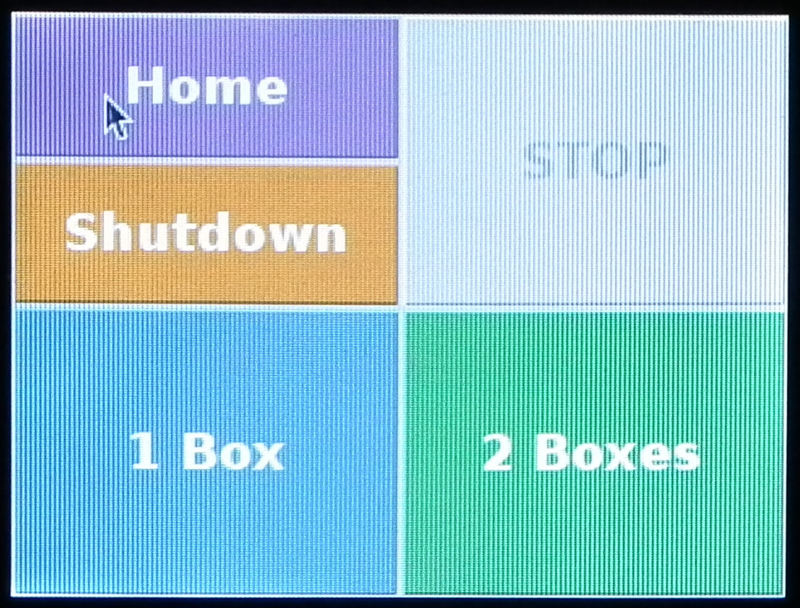

# Program robot to fill vials {#gcode}

Running job without GUI - for testing

<!--
# need 8-9 ml
# pump speed 1800ml/min
# ml/s = 1800/60 = 30
# fill time = 0.3
-->


```
ssh pi@192.168.1.3

sudo minicom -D /dev/ttyACM0 -b115200

?<Idle|MPos:-5.000,-5.000,-4.993|FS:0,0|Ov:100,100,100>

x-10 y-10 z-10
ok
?<Idle|MPos:-10.000,-10.000,-10.005|FS:0,0>


x-20 y-20 z-30
ok
?<Idle|MPos:-20.000,-20.000,-29.996|FS:0,0>


x-8 y-14 z-62
ok
?<Idle|MPos:-8.000,-14.000,-62.006|FS:0,0>


./robot/py/calibrate_pump.py

./robot/py/stream2.py robot/nc/calibrate_pump.nc /dev/ttyACM0

./robot/py/fill_boxes.py

```

## Overview
The movement of the robot is programmed in [G-code](https://en.wikipedia.org/wiki/G-code). We only need nine G-code commands to control the robot (table \@ref(tab:gCodes)).


Table: (\#tab:gCodes)G-code commands used to control robot.

Code   Description                                        
-----  ---------------------------------------------------
x      absolute position of x-axis                        
y      absolute position of y-axis                        
z      absolute position of z-axis                        
g4     dwell time (control parameter p specifies seconds) 
m3     set pump rotation to clockwise                     
m4     set pump rotation to counter clockwise             
m8     start pump                                         
m9     stop pump                                          
$h     initiate homing cycle                              

A G-code program for filling vials of food could be created manually, by listing the necessary commands sequentially in a text file.  However, this would be laborious and error prone. If the size of the boxes of vials are known, the G-code can be programmatically generated. 

## Start system {#startSystem}

Prime pump

<div class="figure" style="text-align: center">

<p class="caption">(\#fig:primeBeaker)Positioning of beaker under nozzle to collect fly food expelled during priming of peristaltic pump.</p>
</div>

Figure \@ref(fig:primeBeaker)

<div class="figure" style="text-align: center">

<p class="caption">(\#fig:primeButton)Prime button on peristaltic pump.</p>
</div>

Figure \@ref(fig:primeButton)


<div class="figure" style="text-align: center">

<p class="caption">(\#fig:loadBoxes2)Loading boxes of vials.</p>
</div>


Figure \@ref(fig:loadBoxes2)


<div class="figure" style="text-align: center">

<p class="caption">(\#fig:touchscreen)Touchscreen interface.</p>
</div>

Figure \@ref(fig:touchscreen)


## Determine box coordinates

First we need to determine the Cartesian coordinates of the first and last vial in each box.


1. Start up system. 

2. Login to raspberry pi using ssh. My raspberry pi has the IP address 192.168.1.3 and so I would use:
```
ssh pi@192.168.1.3
```
Change IP address to match your configuration. Default password for the **pi** user account is 'raspberry'.

3. Use minicom to connect to the Grbl controller running on the Arduino:
```
sudo minicom -D /dev/ttyACM0 -b115200
```

4. Load two boxes into the robot (Figure \@ref(fig:loadBoxes)). 

<div class="figure" style="text-align: center">

<p class="caption">(\#fig:loadBoxes)Loading boxes of vials.</p>
</div>


## Calibrate pump


## Generate G-code instructions for filling vials


