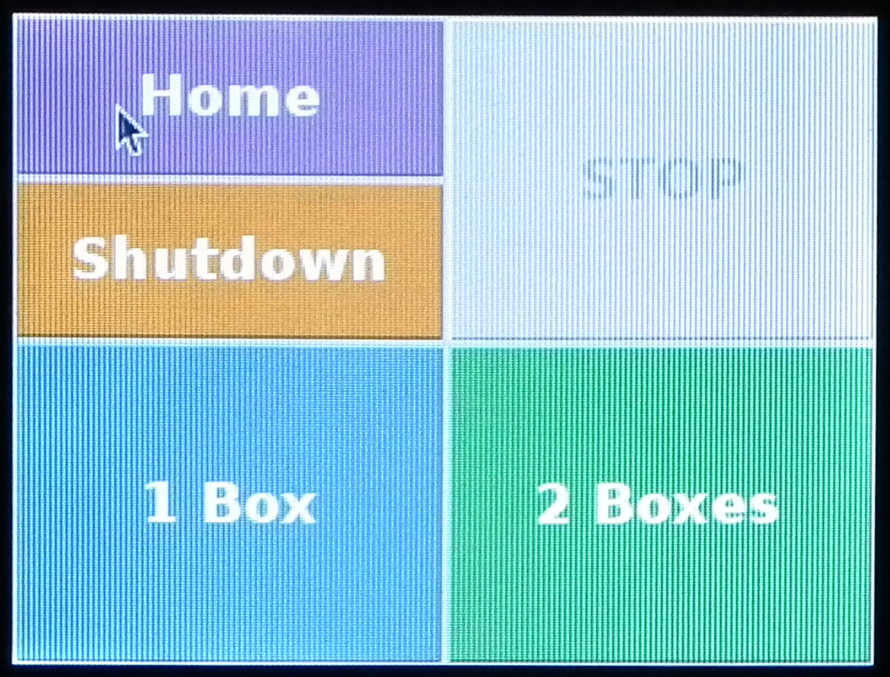
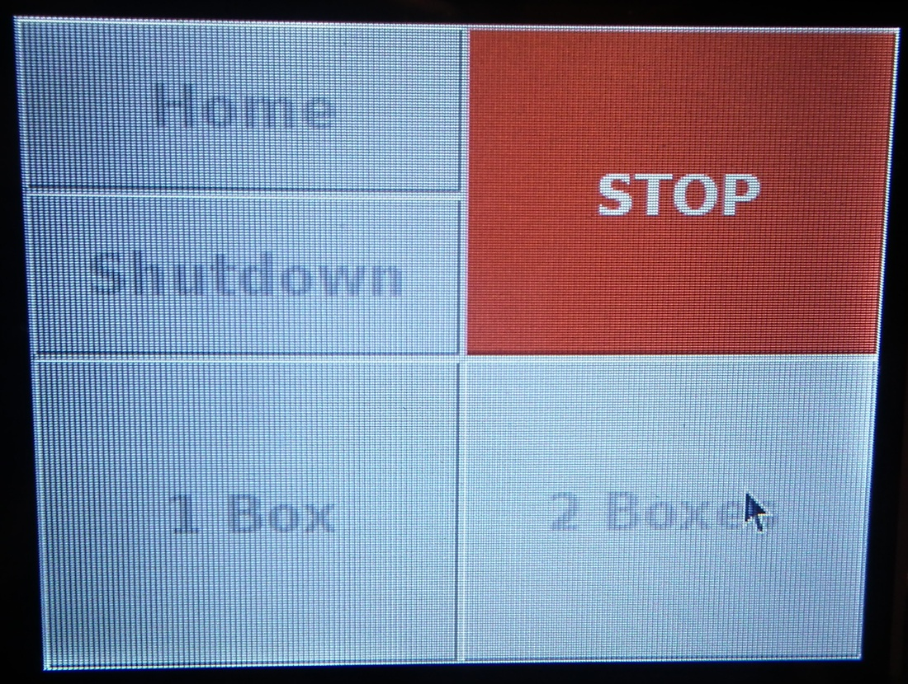

# Routine operation {#operation}

## Prepare system

Instructions for starting the system are provided in section \@ref(startSystem)

## Fill boxes
Load boxes onto platform as described in step 1 of section \@ref(boxCoordinates).

Check orientation of boxes and check vials aligned

From GUI select fill one or two boxes

## Shutdown

(\#fig:touchscreen)Touchscreen interface.

Figure \@ref(fig:touchscreen)

(\#fig:stopRobot)Appearance of touchscreen interface when a job is running.

Figure \@ref(fig:stopRobot)
